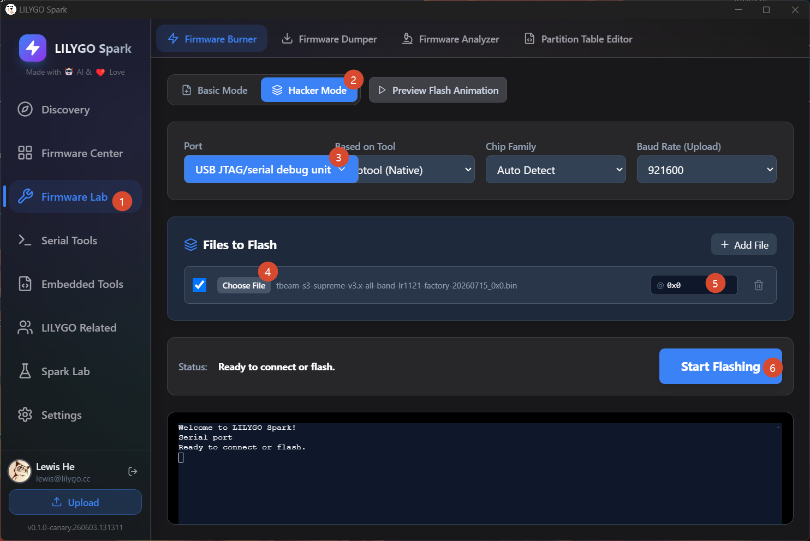

<div align="center" markdown="1">
  
</div>

<h1 align="center">LilyGo 调制解调器 AT 调试固件</h1>

<div align="center">

[English](./README.MD) | [中文](./README_CN.MD)

</div>

## 简介

本目录包含 LilyGo 调制解调器系列产品的 AT 调试固件。这些固件用于**测试和调试调制解调器 AT 指令**——用于快速排查故障

## ESP32 版本

| 产品名称 | AT 调试固件 |
| --- | --- |
| [T-A7670X][1] | [esp32-t-a7670x_atdebug_20251201_0x0.bin](./esp32-t-a7670x_atdebug_20251201_0x0.bin) |
| [T-Call-A7670X-v1.0][2] | [esp32-t-call-a7670x-v1.0-atdebug-20251201_0x0.bin](./esp32-t-call-a7670x-v1.0-atdebug-20251201_0x0.bin) |
| [T-Call-A7670X-v1.1][2] | [esp32-t-call-a7670x-v1.1_atdebug_20251201_0x0.bin](./esp32-t-call-a7670x-v1.1_atdebug_20251201_0x0.bin) |
| [T-A7608][3] | [esp32-t-a7608x-atdebug-20251201_0x0.bin](./esp32-t-a7608x-atdebug-20251201_0x0.bin) |
| [T-SIM7000G][11] | [esp32-t-sim7000g_atdebug_20251201_0x0.bin](./esp32-t-sim7000g_atdebug_20251201_0x0.bin) |
| [T-SIM7070G][10] | [esp32-t-sim7070g_atdebug_20251201_0x0.bin](./esp32-t-sim7070g_atdebug_20251201_0x0.bin) |
| [T-SIM7600G][9] | [esp32-t-sim7600x-atdebug_20251201_0x0.bin](./esp32-t-sim7600x-atdebug_20251201_0x0.bin) |
| [T-PCI-E][8] | [esp32-t-pcie-atdebug-20251201_0x0.bin](./esp32-t-pcie-atdebug-20251201_0x0.bin) |
| [T-A7670X 外接GPS][1] | [esp32-t-a7670x-external-gps-a7670g-only-20260127_0x0.bin](./esp32-t-a7670x-external-gps-a7670g-only-20260127_0x0.bin) |

## ESP32-S3 版本

| 产品名称 | AT 调试固件 |
| --- | --- |
| [T-A7608-S3][4] | [esp32s3-t-a7608x-atdebug-20251201_0x0.bin](./esp32s3-t-a7608x-atdebug-20251201_0x0.bin) |
| [T-SIM7670G-S3][5] | [esp32s3-t-sim7670g-atdebug-251201_0x0.bin](./esp32s3-t-sim7670g-atdebug-251201_0x0.bin) |
| [T-ETH-Elite-S3][7] | [esp32s3-t-eth-elite-atdebug-20251201_0x0.bin](./esp32s3-t-eth-elite-atdebug-20251201_0x0.bin) |

## 标准系列

| 产品名称 | 固件 |
| --- | --- |
| 标准系列 AT 调试固件 | [esp32s3-standard-series-atdebug-20251201_0x0.bin](./esp32s3-standard-series-atdebug-20251201_0x0.bin) |
| 标准系列 摄像头WebServer SoftAP | [esp32s3-standard-series-camera-web-server-softap-20251201_0x0.bin](./esp32s3-standard-series-camera-web-server-softap-20251201_0x0.bin) |
| 标准系列 外接GPS扩展板 | [esp32s3-standard-series-external-gps-20260108_0x0.bin](./esp32s3-standard-series-external-gps-20260108_0x0.bin) |

> 标准系列板子引脚兼容，不同调制解调器之间无需区分固件。

[1]: https://www.lilygo.cc/products/t-sim-a7670e
[2]: https://www.lilygo.cc/products/t-call-v1-4
[3]: https://lilygo.cc/products/t-a7608e-h?variant=42860532433077
[4]: https://lilygo.cc/products/t-a7608e-h
[5]: https://lilygo.cc/products/t-sim-7670g-s3
[7]: https://lilygo.cc/products/t-eth-elite-1
[8]: https://lilygo.cc/products/a-t-pcie
[9]: https://lilygo.cc/products/t-SIM7600
[10]: https://lilygo.cc/products/t-sim7070g
[11]: https://lilygo.cc/products/t-sim7000g

---

## 烧录指南

### 方法一：LILYGO Spark（推荐）

1. 下载 [LILYGO Spark](https://lilygo.cc/pages/lilygo-spark)



### 方法二：ESP Download Tool

* [Flash Download Tool 使用指南](https://docs.espressif.com/projects/esp-test-tools/en/latest/esp32/production_stage/tools/flash_download_tool.html)

| 步骤 | ESP32 版本 | ESP32-S3 版本 |
| --- | --- | --- |
| 步骤 1 |  |  |
| 步骤 2 |  |  |

### 方法三：网页烧录

1. 打开 [ESP Web Flasher 在线工具](https://espressif.github.io/esptool-js/)
2. 选择正确的开发板和波特率
3. 选择下载的 `.bin` 固件文件
4. 点击 "Program" 开始烧录


> 烧录完成后，按下 **RST** 按钮复位开发板。

### 方法四：命令行（esptool）

如果尚未安装 esptool：

```bash
pip install esptool
```

**ESP32：**

```bash
esptool --chip esp32 --baud 921600 --before default_reset --after hard_reset write_flash -z --flash_mode dio --flash_freq 80m 0x0 firmware.bin
```

**ESP32-S3：**

```bash
esptool --chip esp32s3 --baud 921600 --before default_reset --after hard_reset write_flash -z --flash_mode dio --flash_freq 80m 0x0 firmware.bin
```

请将 `firmware.bin` 替换为您下载的实际固件文件名。

---

## 常见问题

### 无法上传程序 —— 手动进入上传模式

1. 通过 USB 数据线连接开发板
2. 按住 **BOOT** 按钮不放
3. 在按住 BOOT 的同时，按下 **RST** 按钮
4. 松开 **RST** 按钮
5. 松开 **BOOT** 按钮
6. 上传程序

> [!IMPORTANT]
> **ESP32 版本**：SD 卡使用 IO2 作为 CS 引脚。在 Arduino IDE 中**插入 SD 卡时无法上传代码**。上传新代码前请**先取出 SD 卡**。
